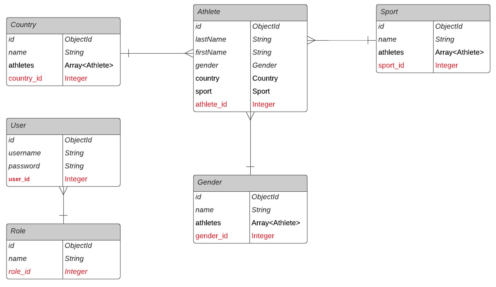

# General info
## Instructions
- Créer un dossier "OlympicGameAPI" en local
- Faire en git clone du projet dans ce dossier crée
- Ouvrir un terminal et lancer la commande ```npm install```
- Récuperer le fichier .env (pour recuperer info connexion bdd) envoyé par mail et le coller à la racine du dossier projet
- Selon OS (Mac ou Window) l'url modifier ligne 27 dans app.js
    - ```app.use(express.static('../assets'));``` ---> Windows
    - ```app.use(express.static('assets'));``` ---> MacOS
- Ouvrir un ligne de commande à partir du dossier "src" et lancer une commande ```nodemon server```
- Ouvrir un navigateur et se rendre sur la page http://localhost:3000/

Certaines fonctionnalités fonctionnent depuis Postman (récuperer les fichiers json envoyés par mail)  mais n'ont pas été implemntées côté Front (voir la checklist)

## TP NodeJs & Chatbot
L'objectif du TP 1 est de construire une plate-forme pour manipuler et stocker des données liées aux Jeux Olympiques. Cette plate-forme expose une API REST et une interface d'administration. Elle doit être réalisée avec Node.js, Express.js, MongoDB et Mongoose. Pour le TP 2 (en 2021), la plate-forme sera le socle d'un chatbot d'information sur les JO

-----------------------------------------------------------

### Principes pour l'implémentation
L'organisation des Jeux Olympiques implique la mise à place d'événements de compétition pour chacun des sports olympiques, impliquant les meilleures athlètes de la planète. Pour mieux appréhender la nature des données en jeu, se reporter notamment la page Calendrier des JO 2020 (opens new window). Pour gérer les données (i.e. leur administration), une interface Web est mis en place pour gérer le référentiel des données, organisées sous forme de collections MongoDB :

- Disciplines sportives (collection sports) ;
- Athlètes (collection athletes) ;
- Utilisateurs administrateurs (collection adminusers) => En option !

-----------------------------------------------------------
### Technologies utilisées
  - NodeJS - Platform
  - Express - Framework
  - JavaScript - Programming Language
  - MongoDB - Database
  - Mongoose - ORM
  

# Database
### Conception



# API REST
### Endpoint Sports
- [x]  Créer un sport : ```POST /api/sports```
- [x]  Lister les sports : ```GET /api/sports```
- [x]  Consulter les athlètes d'un sport :``` GET /api/sports/{sportId}/athletes```
- [x]  Ajouter un athlète dans un sport : ```POST /api/sports/{sportId}/athletes/{athleteId}```

### Endpoint Athlètes
- [x]  Créer un athlète : ```POST /api/athletes```
- [x]  Lister les athlètes : ```GET /api/athletes```
- [x]  Consulter les sports d'un athlète : ```GET /api/athletes/{athleteId}/sports```
- 
### Endpoint Utilisateurs administrateurs (optionnel)
- [x]  Créer un utilisateur : ```POST /api/users```
- [x]  Mettre à jour un utilisateur : ```PUT /api/users/{userId}```
- [x]  Lister les utilisateurs : ```GET /api/users```
- [x]  Consulter un utilisateur : ```GET /api/users/{userId}```

# Interface Web
Concevoir et développer des pages pour lister / créer les sports et les athlètes. Note d'implémentation : pour les pages Web, les groupes peuvent choisir soit d'utiliser les templates Handlebars, soit d'exploiter les API REST en JavaScript via Axios côté client.

En option :
- protéger le site web d'administration avec un système d'authentification
- concevoir et développer des pages pour lister / consulter / créer / supprimer les utilisateurs administrateurs
- concevoir et développer des pages pour modifier les sports et les athlète

### Pages Web Sports/Athlètes
- [x] Page Web Lister les sports
- [x] Page Web Lister les athlètes
- [x] Page Web Créer un sport (formulaire)
- [x] Page Web Créer un athlète (formulaire)
-----------------------------------------------------------

### Autres pages Web Sports/Athlètes (optionnel)
- [x] Page Web ou fonctionnalité Supprimer un sport
- [x] Page Web ou fonctionnalité Supprimer un athlète
- [ ] Page Web Modifier un sport (formulaire) --> Methode API REST dispo sur POSTMAN pas implementé coté Front 
- [ ] Page Web Modifier un athlète (formulaire)  --> Methode API REST dispo sur POSTMAN pas implementé coté Front
- [ ] Pages Web Utilisateurs (optionnel) --> Methode API REST dispo sur POSTMAN pas implementé coté Front
- [ ] Page Web Lister les utilisateurs  --> Methode API REST dispo sur POSTMAN pas implementé coté Front
- [ ] Page Web Créer un utilisateur (formulaire) --> Methode API REST dispo sur POSTMAN pas implementé coté Front
- [ ] Page Web ou fonctionnalité Supprimer un utilisateur --> Methode API REST dispo sur POSTMAN pas implementé coté Front
- [ ] Page Web Modifier un utilisateur (formulaire) --> Methode API REST dispo sur POSTMAN pas implementé coté Front
-----------------------------------------------------------

### Autres options avancées (optionnel)
- [x] Authenfication sur les API REST
- [ ] Page Web de connexion avec login/mot de passe utilisateur --> Methode API REST dispo sur POSTMAN pas implementé coté Front


## Rendu attendu
- [x] Code source sur un repo Git (sans le dossier node_modules 🙏)
- [x] ```README.md```
- [x] Instructions pour installer le projet (git clone, npm install, npm start, éventuels exemples de commande curl, ...)
- [x] Checklist des API et des fonctionnalités Web avec un statut des tests (OK ✅ ou KO ❌)


## Deadline 
Dimanche 9 janvier 2022 à minuit 